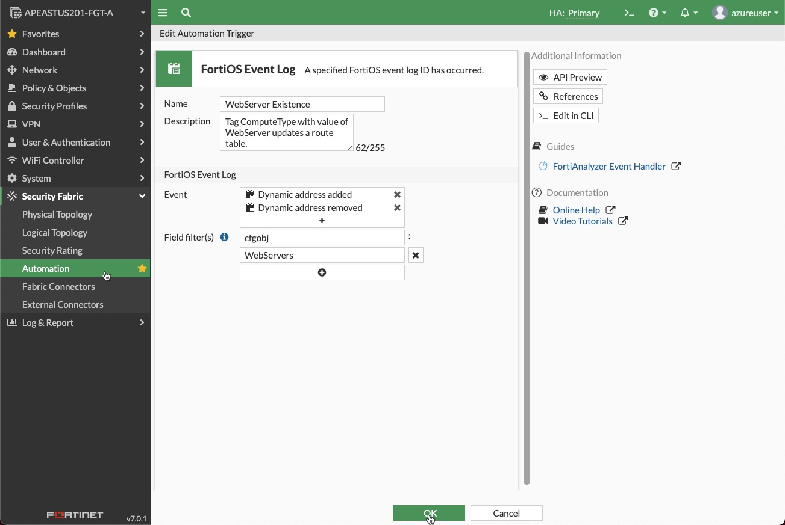

# Azure Micro-Segmentation Using Azure Automation and FortiGate Automation Stitches

## Create an Azure RunBook and configure a FortiGate Automation Stitch

A FortiGate Automation Stitch brings together a Trigger and an Action. In this code the trigger is a log event and the action is the execution of a webhook.

* The Trigger - a log event is generated when an IP address is added or removed from a FortiGate dynamic address object
* The Action - a webhook sends an HTTPS POST request to an endpoint in Azure. The endpoint runs a PowerShell script to update an Azure route table. The HTTP headers and JSON formatted body contain the information required to update the route table to manage micro-segmentation through the use of host routes. A host route is a route that indicates a specific host by using the IP-ADDRESS/32 in IPV4

This code covers the

* Setup of an Azure Automation Account
* Importing Azure PowerShell Modules into the Automation Account
* Creation and Publishing of an Azure Automation Account Runbook
* Creation of an Azure Automation Account Webhook to invoke the Runbook
* Creation of a FortiGate Dynamic Address
* Creation of a FortiGate Automation Stitch
* Creation of a FortiGate Automation Stitch Trigger
* Creation of a FortiGate Automation Stitch Action

### Part 1. Azure

Automation in Azure can be accomplished in a number of ways, Logic Apps, Function Apps, Runbooks, etc. Each of the automation methods can be triggered in a number of ways, for example Events, Webhooks, and Schedules.

The Azure Cloudshell PowerShell commands shown below create an Azure Automation account that enables the running of an Azure Runbook via a Webhook. An Azure Runbook is just a script, in this case PowerShell, that the Automation Account can run. The __Actions__ the Runbook can perform are controlled by the rights and scope (where those actions can be performed) that have been granted to the Automation Account.

The __Actions__ are provided by PowerShell Modules that have been imported into the Automation Account. The PowerShell Modules are libraries of commands called Cmdlets that are grouped into several domains. For example, Accounts, Automation, Compute, Network, and Resources.

All of the steps below can be performed by clicking and typing in the Azure Portal. However, the commands shown in each section can be run directly in Azure Cloudshell. Cloudshell has all the required utilities to execute the commands. Nothing additional needs to be loaded on a personal device.

1. __Azure Automation Account__
    * Create an Azure [Automation Account](https://docs.microsoft.com/en-us/azure/automation/automation-create-standalone-account)

        1. Create a new Resource Group

        ```PowerShell
        New-AzResourceGroup -Name "resource-group-name-of-the-automation-account" -Location azure-location
        ```

        1. Create an Automation Account in the new Resource Group
            * Choose a Location
            * Provide a Name - for example, user-automation-01
            * Choose the Basic Plan
            * Indicate the assignment of a System Assigned Identity </br></br>

        ```PowerShell
        New-AzAutomationAccount -ResourceGroupName "resource-group-name-of-the-automation-account" -Location eastus -Name "user-automation-01" -AssignSystemIdentity -Plan Basic
        ```

    * Setup Automation Account [Managed Identity](<https://docs.microsoft.com/en-us/azure/active-directory/managed-identities-azure-resources/overview>)
      * The Managed Identity allows the Automation Account to execute the PowerShell Runbook with the prescribed rights and scope. The prescribed rights and scope in this case will be __contributor__ and the Resource Group where the target Route Table is located.

        ```PowerShell
        New-AzRoleAssignment -ObjectId (Get-AzAutomationAccount -ResourceGroupName "resource-group-name-of-the-automation-account" -Name user-automation-01).Identity.PrincipalId -RoleDefinitionName "Contributor" -Scope (Get-AzResourceGroup -Name "resource-group-name-of-the-target-route-table" -Location eastus).ResourceId
        ```

    * Import Az PowerShell Modules
        * Az.Accounts - This module needs to be imported first as the other modules have a dependency on it.
        * Az.Automation
        * Az.Compute
        * Az.Network
        * Az.Resources

        ```PowerShell
        Import-AzAutomationModule -ResourceGroupName "resource-group-name-of-the-automation-account" -AutomationAccountName user-automation-01 -Name Az.Accounts  -ContentLinkUri https://www.powershellgallery.com/api/v2/package/Az.Accounts
        @("Automation","Compute","Network","Resources") | ForEach-Object {Import-AzAutomationModule -ResourceGroupName "resource-group-name-of-the-automation-account" -AutomationAccountName user-automation-01 -Name Az.$_  -ContentLinkUri https://www.powershellgallery.com/api/v2/package/Az.$_}
        ```

</br>

1. __Azure Automation Runbook__
    * Create, Import, and Publish Runbook
      * The Runbook in the example is named `ManageDynamicAddressRoutes`. When importing the Runbook provide a Path that is relative to where the `Import-AzAutomationRunbook` Cmdlet is being run.

        ```PowerShell
        New-AzAutomationRunbook -ResourceGroupName "resource-group-name-of-the-automation-account" -AutomationAccountName user-automation-01 -Name ManageDynamicAddressRoutes -Type PowerShell
        
        Import-AzAutomationRunbook -Name ManageDynamicAddressRoutes -ResourceGroupName "resource-group-name-of-the-automation-account" -AutomationAccountName user-automation-01 -Path ManageDynamicAddressRoutes.ps1 -Type PowerShell –Force
        
        Publish-AzAutomationRunbook -ResourceGroupName "resource-group-name-of-the-automation-account" -AutomationAccountName user-automation-01 -Name ManageDynamicAddressRoutes
        ```

    * Create Webhook
      * The example command below uses `routetableupdate` as the Webhook name

        ```PowerShell
        New-AzAutomationWebhook -ResourceGroupName "resource-group-name-of-the-automation-account" -AutomationAccountName user-automation-01 -RunbookName ManageDynamicAddressRoutes -Name routetableupdate -IsEnabled $True -ExpiryTime "07/12/2022" -Force
        ```

        The output will include the URI of the enabled webhook. The webhook URI is only viewable at creation and cannot be retrieved afterwards. The output will look similar to below.

        ```text
        ResourceGroupName     : automation-01
        AutomationAccountName : user-automation-01
        Name                  : routetableupdate
        CreationTime          : 7/13/2021 8:33:28 PM +00:00
        Description           :
        ExpiryTime            : 7/12/2022 12:00:00 AM +00:00
        IsEnabled             : True
        LastInvokedTime       : 1/1/0001 12:00:00 AM +00:00
        LastModifiedTime      : 7/13/2021 8:33:28 PM +00:00
        Parameters            : {}
        RunbookName           : ManageDynamicAddressRoutes
        WebhookURI            : https://f5f015ed-f566-483d-c972-0c2c3ca2a296.webhook.eus2.azure-automation.net/webhooks?token=P1GSd4Tasf5i1VYaVkFQvG29QCjkA8AOHY%2bsVLZOFSA%3d
        HybridWorker          :
        ```

### Part 2. FortiGate

A FortiGate Automation Stitch brings together a Trigger and one of more Actions.

In this example

* The Trigger is the existence (appearance/disappearance) of a VM with a specific Tag and Value in the monitored Azure Environment.
* The Action is the addition or removal of a host route for that VM in a target route table.

Utilizing the [FortiGate Azure SDN Connector](https://docs.fortinet.com/document/fortigate-public-cloud/7.0.0/azure-administration-guide/502895/configuring-an-sdn-connector-in-azure), [Azure information](https://docs.fortinet.com/document/fortigate-public-cloud/7.0.0/azure-administration-guide/489236/configuring-an-azure-sdn-connector-for-azure-resources) is periodically retrieved based on the SDN Connector's scope.

When a VM is seen with the Tag `ComputeType` and the Value `WebServer` or `DbServer`, the Trigger portion of the FortiGate Automation Switch is activated. The Action portion of the FortiGate Automation Stitch is a call to the Webhook associated to the Runbook created in Azure.

This example utilizes an Azure Tag and its value to determine if the target route table needs to be updated. The code referenced here can be used to create the FortiGate configurations using the FortiGate CLI. The FortiGate GUI can be utilized can be utilized as well. However, when using the GUI the FortiGate presents `Filter` criteria based on items that __exist__ in the SDN target scope.

1. __FortiGate Dynamic Addresses__
When using the GUI the FortiGate presents `Filter` criteria based on items that __exist__ in the SDN target scope. USe the CLI to create a FortiGate Dynamic Address for a Tag that does not exist yet in Azure.
    * Create Dynamic Address to match a [DbServer](FortiGate/address-DbServers.cfg)
        * Tag: __ComputeType__
        * Value: __DbServer__
    * Create Dynamic Address to match a [WebServer](FortiGate/address-WebServers.cfg
        * Tag: __ComputeType__
        * Value: __WebServer__

    Example Dynamic Address CLI Configuration
    

    Example Dynamic Address GUI Configuration
    

    Example SDN log events showing the removal of IP address 10.1.20.5 and the the addition of IP address 10.1.21.4 to the __WebServers Dynamic Address__ object.
    

1. __FortiGate Automation Stitch__
The following actions are focused on the __WebServers__ Dynamic Address object, Trigger and Action that comprise an Automation Stitch.  The same actions would need to be taken to support the __DbServers__ Dynamic Address object.

    * Create [Trigger](FortiGate/routetableupdate-trigger-WebServers.cfg)
        * Log Address Added
        * Log Address Removed

    Example Trigger CLI Configuration
    

    Example Trigger List GUI
    

    Example Trigger GUI Configuration
    

    * Create [Action](FortiGate/routetableupdate-action.cfg)
        * Webhook - the URI of the Azure Automation Account Runbook
        * Body - the IP address of the VM that was added or removed from the Azure environment
        * Headers - the headers that specify the Azure
            * Resource Group - the Azure Resource Group where the target route table is located
            * Route Table Name - the target route table
            * Next Hop IP - the IP of the Next Hop, this is the active FortiGate
    * Create [Stitch](FortiGate/routetableupdate-stitch-WebServers.cfg)
        * Trigger
        * Action
